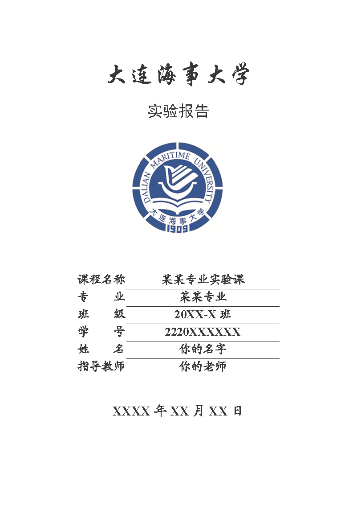

# dlmuucexpreport 

**非官方大连海事大学本科实验报告模板**

## 简介

dlmuucexpreport（即 Report Template for Dalian Maritime University Undergraduate Course Experiment (Unofficial)）模板是基于 $\LaTeX$ 编写的 **非官方** 大连海事大学本科实验报告模板，主要用于本科阶段的实验报告撰写和编辑。

编写这个模板的起因是因为本学期的实验课要求提交实验报告，但是实验报告要求文件的末尾附上了整整四页纸的格式要求。在被 Microsoft Word 折磨了半个多小时之后，我开始着手编写这个模板。

模板旨在让使用者省去繁琐的格式调试、专注于实验报告内容的编写，希望后来人不要再受调整格式的这个苦。格式要求基于教师下发的实验报告模板和格式要求文件（文件现置于工作区目录下的 `document/` 文件夹下）。

**该项目是本人的第一个开源的 $\LaTeX$ 模板项目，目前模板仍有许多不足之处，欢迎大家参与模板的改进工作。**

## 模板的使用方法

### 编写

实验报告的各个章节集中放置于 `chapters/` 目录下，编译主文件 `main.tex` 以构建文档。

其他信息另请参阅 `example.pdf`。

### 编译

如果您使用 GNU Make 可以使用 `make` 命令编译模板：

```shell
make # 编译模板并自动清理工作区
make clean # 删除全部生成文件
make clear # 只是删除辅助文件和日志文件
```

如果您不使用 GNU Make，文档需按照如下顺序编译：

XeLaTeX → Biber → XeLaTeX → XeLaTeX

您可在终端下执行：

```shell
xelatex main.tex
biber main # 编译引用格式
xelatex main.tex
xelatex main.tex
latexmk -c # 清理工作区
```

## 帮助完善这篇模板

如果您在模板中发现任何不足，欢迎参与模板的改进工作。您可以在本模板的 GitHub Repo 提交相应的 Issue/Pull Request，或者创建模板的 Fork。

## 排版效果展示

下图展示了模板封面页的排版效果。



## 更新日志

- 2024 年 7 月 23 日：允许修改封面上的标题和学校名称
- 2024 年 8 月 1 日：修正了章节标题换行的错误；变更文档类型由 ctexart 为 ctexbook
- 2024 年 8 月 21 日：补充说明了有关封面样式差异的问题
- 2024 年 9 月 13 日：修复了封面样式的细微差异；修正了引用文献角标没有方括号的问题。
- 2024 年 9 月 26 日：改进表格字号控制；修正了款项标题编号不显示的问题，改进了款项标题样式。
- 2024 年 10 月 10 日：修正了款项标题的段前段后间距为0行
- 2024 年 10 月 14 日：在文档中新增了文件目录说明